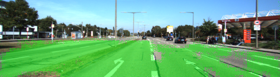
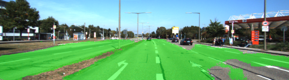
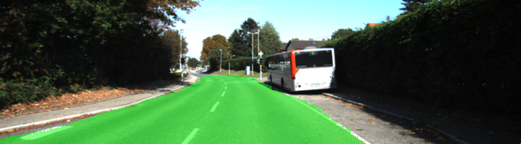
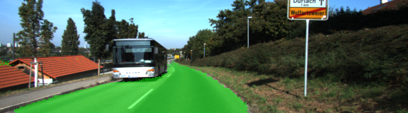
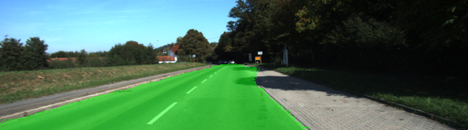
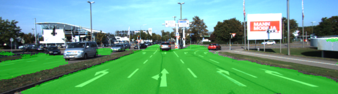

# Semantic Segmentation

### Introduction
In this project, you'll label the pixels of a road in images using a Fully Convolutional Network (FCN).

### Overview

The main goal for this project is apply 8 layers Fully Convolution Neural Network(FCN-8) idea to segragate the road surface from all other objects such as sidewalk, other cars, people, building, grass etc. FCN will take advantage of pretrained mode such as VGG 16 mode, use it as input, (the encoder part), then transfer to the decoder part, upsample to the same size as input image. There are 2 skipped connections in between encoder and decoder. This operation preserves the critical spatial information. 

KITTI dataset includes training set and test set. Orginal image size is 1242x375. We are resize to 576x160. The FCN pipeline is based on the new image size. Each training image pair with ground truth image which shows marked road surface. FCN trained on this dataset, test on unseed test dataset. 

### Pretrained VGG Model

Train a Convolution Neural Network is time and resource consuming process. The good new is there are some good pretrained model available to accelerate the process. The choosen VGG 16 has 7 convolution layers, we can export input layer, the VGG drop out rate, the layer 3, 4, 7 out for further process. 

The VGG model is available at https://s3-us-west-1.amazonaws.com/udacity-selfdrivingcar/vgg.zip. The model is fairly big 951M. 

### Encoder and Decoder

The encoder for FCN-8 is the VGG16 model pretrained on ImageNet for classification. The first encoder layer will get from 
```
vgg_input_tensor_name = 'image_input:0'
... ...
vgg_input = vgg_graph.get_tensor_by_name(vgg_input_tensor_name)
```
Then we get the other layers 3, 4, and 7 from the model.

In order to preserve spatial information, all 3 output layers are immidiately followed by a 1x1 convolutional layer.  

Now we move to the decoder part. Decoder layer 1 is after the last encoder layer (which is condictioned vgg_layer7_out). 

Next in the pipeline is Decoder layer 2 is an upsample layer follows the decoder layer 1. The output size for this layer is same as the encoder layer 2 (vgg_layer4_out). It also has a skip connection from the encoder layer 2. 
```
skip_layer3 = tf.layers.conv2d(vgg_layer3_out, num_classes, 1, padding= 'same', 
        kernel_initializer= ci, kernel_regularizer= kr)

# upsample
dec_layer2_in = tf.layers.conv2d_transpose(dec_layer1_out, num_classes, 4, 
        strides= (2, 2), padding= 'same', 
        kernel_initializer= ci, kernel_regularizer= kr)

# combine matched encoder layer 2(vgg_layer_4) and decoder layer 2 to preserve spatial information
dec_layer2_out = tf.add(dec_layer2_in, skip_layer2)

```
Same process apply to decoder layer 3 as well, with skip connection from encoder layer 1(vgg_layer3_out). 

The last decoder layer is upsimpled from decoder layer 3, no skip connection.  

### Optimize and Train the Model

Now, we can compare the last layer output with the ground truth in tensorflow format. 

Using cross entropy function and Adam Optimizer. 

```
cross_entropy_loss = tf.reduce_mean(
        tf.nn.softmax_cross_entropy_with_logits(logits=logits, labels=labels))
train_op = tf.train.AdamOptimizer(learning_rate).minimize(cross_entropy_loss)
```
The training hyperparameters are settled at:
```
epochs = 25
batch_size = 10
learning_rate = 0.0001
```

### Model Performance

Based on the following setting in the 1x1 convolution layer and upsample layer, 
```
ci = tf.random_normal_initializer(stddev=0.01)
kr = tf.contrib.layers.l2_regularizer(1e-3)
```
the model is able to reduce the loss under 0.1 within 2-3 epochs, and come up some meaningful result in 5 epochs, with fuzzy edge. 25 epochs can reach the loss about 0.03-0.05. It will clearly seperate the road from most of the pictures.   

Without the initializer and regularizer, 25 epochs will not enough to bring the loss down to 0.500. At this level, it cannot yield meaningful result. 

Based on GTX 1070 GPU, it will take average 32 seconds to completed one epoch. The GPU can handle batch_size 10, more VRAM can handle larger batch_size. Larger batch_size such as 10 does make process 20% quicker than batch size 5. 

The learning rate seems right with this epoch and batch_size setting. It is slowly reach the lower loss, but not stop there yet. The model is not overfit yet.  

With current dataset, I didn't go further on the epochs. Compare the same image from epoch 5 and epoch 25.  
<p align="center">
 
</p>
<p align="center">
 
</p>

There are more images from epoch 25. In most of the cases, the green dots are attached to the road surface, not on cars, people and buildings. The edge of the road and sidewalk or grass is clear. The road surface can flow into intersection, parking lot and opposite lanes.  
<p align="center">
 
</p>
<p align="center">
 
</p>
<p align="center">
 
</p>
<p align="center">
 
</p>
<p align="center">
 
</p>

### Future Works


### Setup
##### Frameworks and Packages
Make sure you have the following is installed:
 - [Python 3](https://www.python.org/)
 - [TensorFlow](https://www.tensorflow.org/)
 - [NumPy](http://www.numpy.org/)
 - [SciPy](https://www.scipy.org/)
##### Dataset
Download the [Kitti Road dataset](http://www.cvlibs.net/datasets/kitti/eval_road.php) from [here](http://www.cvlibs.net/download.php?file=data_road.zip).  Extract the dataset in the `data` folder.  This will create the folder `data_road` with all the training a test images.

### Start
##### Implement
Implement the code in the `main.py` module indicated by the "TODO" comments.
The comments indicated with "OPTIONAL" tag are not required to complete.
##### Run
Run the following command to run the project:
```
python main.py
```
**Note** If running this in Jupyter Notebook system messages, such as those regarding test status, may appear in the terminal rather than the notebook.

### Submission
1. Ensure you've passed all the unit tests.
2. Ensure you pass all points on [the rubric](https://review.udacity.com/#!/rubrics/989/view).
3. Submit the following in a zip file.
 - `helper.py`
 - `main.py`
 - `project_tests.py`
 - Newest inference images from `runs` folder
 
 ## How to write a README
A well written README file can enhance your project and portfolio.  Develop your abilities to create professional README files by completing [this free course](https://www.udacity.com/course/writing-readmes--ud777).
